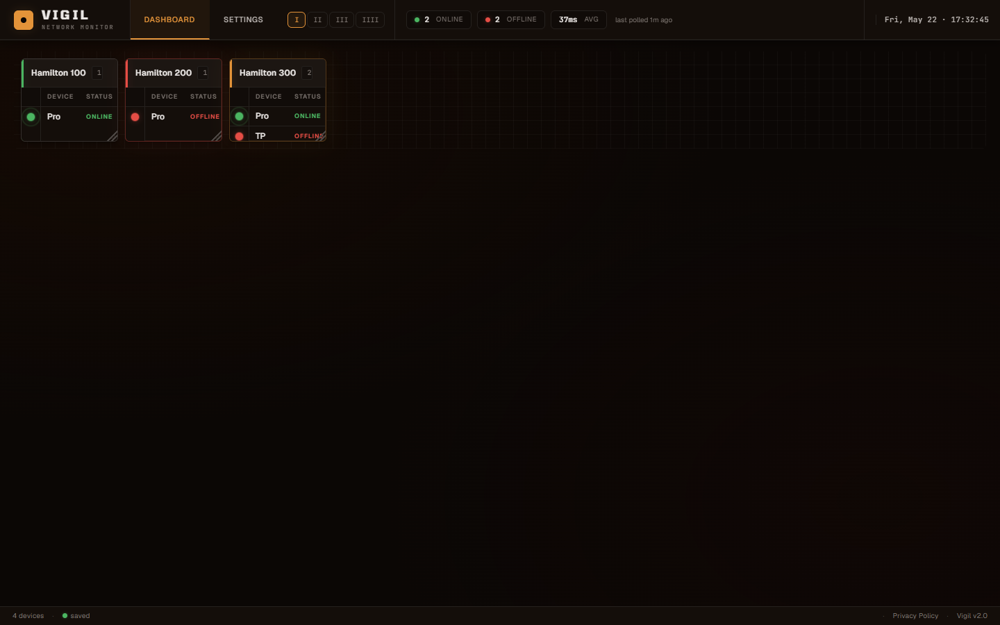
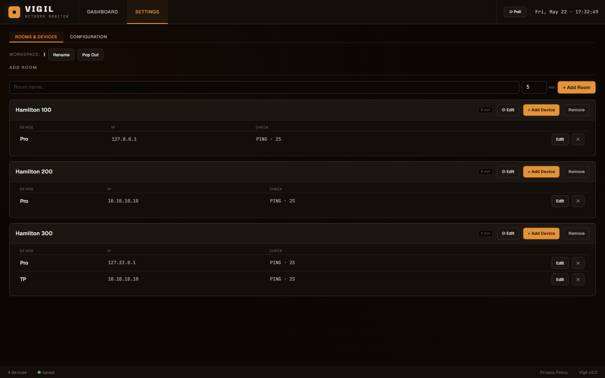

# Vigil

**Network device monitor for AV and IT infrastructure.**

Vigil is a lightweight local web application that monitors network gear by room.
Add rooms, register devices by IP address, and watch live green/red status lights
update automatically via ICMP ping or UDP handshake polling -- no cloud, no account,
no database, nothing to configure beyond Python and two packages.





---

## Table of Contents

- [Complete Setup Guide (Start Here)](#complete-setup-guide-start-here)
  - [What You Need](#what-you-need)
  - [Step 1 -- Install Python](#step-1----install-python)
  - [Step 2 -- Download Vigil](#step-2----download-vigil)
  - [Step 3 -- Open a Command Prompt in the Vigil Folder](#step-3----open-a-command-prompt-in-the-vigil-folder)
  - [Step 4 -- Install Required Packages](#step-4----install-required-packages)
  - [Step 5 -- Run Vigil](#step-5----run-vigil)
  - [Step 6 -- Open the Browser](#step-6----open-the-browser)
  - [How to Stop Vigil](#how-to-stop-vigil)
  - [How to Start Vigil Again Later](#how-to-start-vigil-again-later)
- [Features](#features)
- [Requirements](#requirements)
- [Project Structure](#project-structure)
- [The Two Screens](#the-two-screens)
  - [Dashboard Screen](#dashboard-screen)
  - [Settings Screen](#settings-screen)
- [Using the Dashboard](#using-the-dashboard)
  - [Status Lights](#status-lights)
  - [Column Controls](#column-controls)
- [Using the Settings Screen](#using-the-settings-screen)
  - [Adding Rooms](#adding-rooms)
  - [Adding Devices](#adding-devices)
  - [Editing and Deleting](#editing-and-deleting)
  - [Saving Configuration](#saving-configuration)
  - [Exporting and Importing Config](#exporting-and-importing-config)
- [HTTPS and the Browser Security Warning](#https-and-the-browser-security-warning)
- [Check Methods](#check-methods)
  - [ICMP Ping](#icmp-ping)
  - [UDP Handshake](#udp-handshake)
  - [SSH Check](#ssh-check)
  - [HTTP(S) Check](#https-check)
  - [Choosing the Right Method](#choosing-the-right-method)
- [Poll Intervals](#poll-intervals)
- [Configuration File](#configuration-file)
- [REST API Reference](#rest-api-reference)
- [Command-Line Options](#command-line-options)
- [Network Setup & Deployment](#network-setup--deployment)
  - [How an Unmanaged Switch Handles Addressing](#how-an-unmanaged-switch-handles-addressing)
  - [Port Security](#port-security)
  - [Static IP Addresses](#static-ip-addresses)
  - [Reachability Checks](#reachability-checks)
  - [Pre-Deployment Checklist](#pre-deployment-checklist)
- [Troubleshooting](#troubleshooting)

---

## Complete Setup Guide (Start Here)

This section walks through every step from a brand-new Windows PC to a running
Vigil dashboard. No prior experience with Python or the command line is needed.

> **Mac or Linux user?**
> The steps are the same. Anywhere you see `python` in a command, use `python3` instead.
> Open **Terminal** (Mac: Spotlight > Terminal, Linux: Ctrl+Alt+T) wherever
> the guide says to open Command Prompt.

---

### What You Need

Before you start, make sure you have:

- A Windows, Mac, or Linux computer
- An internet connection (to download Python and the packages -- one time only)
- The Vigil project files (the folder you downloaded)
- A web browser (Chrome, Edge, Firefox -- anything modern)

That is all. Vigil has no database, no installer, and no account to create.

---

### Step 1 -- Install Python

Python is the programming language Vigil is written in. You need to install it
once and it stays on your computer permanently.

**Check if Python is already installed**

1. Press the **Windows key** on your keyboard
2. Type **cmd** and press **Enter** -- a black window called Command Prompt opens
3. Type the following and press Enter:

```
python --version
```

If you see something like `Python 3.11.4` or any version starting with **3.10 or higher**,
Python is already installed. Skip to Step 2.

If you see `'python' is not recognized` or a version starting with 3.9 or lower,
follow the download steps below.

---

**Download Python (Windows)**

1. Open your browser and go to: **https://www.python.org/downloads/**
2. Click the big yellow **Download Python** button
3. Open the downloaded file (named something like `python-3.12.x-amd64.exe`)
4. The Python installer opens. **Before clicking Install Now, do this:**
   - Check the box at the bottom that says **"Add python.exe to PATH"**
     (this is critical -- without it, Python will not work from the command line)
5. Click **Install Now** and wait for it to finish

**Verify Python installed correctly**

1. Press Windows key, type `cmd`, press Enter
2. Type `python --version` -- you should see something like `Python 3.12.3`

---

**Download Python (Mac)**

1. Go to: **https://www.python.org/downloads/**
2. Click the big yellow **Download Python** button
3. Open the downloaded `.pkg` file and follow the installer
4. Open **Terminal** (Cmd+Space, type Terminal, press Enter)
5. Type `python3 --version` -- you should see `Python 3.12.3`

---

### Step 2 -- Download Vigil

If you are reading this file, you already have the Vigil folder. Skip to Step 3.

If you need to download it:

1. Go to: **https://github.com/MatthewRyanWeber/vigil**
2. Click the green **Code** button, then **Download ZIP**
3. Right-click the ZIP and click **Extract All** (Windows) or double-click it (Mac)
4. Move the extracted `vigil` folder somewhere easy to find, like your Desktop

---

### Step 3 -- Open a Command Prompt in the Vigil Folder

You need a command prompt window pointed at the Vigil folder.

**Method A -- File Explorer (easiest on Windows)**

1. Open **File Explorer** (Windows key + E)
2. Navigate to the Vigil folder (wherever you saved it)
3. Click the **address bar** at the top of the window
4. Clear it, type `cmd`, and press **Enter**

A Command Prompt opens already pointed at the right folder.

**Confirm you are in the right place** by typing `dir` and pressing Enter.
You should see files including `vigil.py`, `requirements.txt`, and `README.md`.

---

### Step 4 -- Install Required Packages

Vigil needs two Python packages: **Flask** (the web server) and **cryptography**
(for HTTPS). Install both with one command -- type the following and press Enter:

```
pip install -r requirements.txt
```

You will see text scrolling as pip downloads and installs everything.
When finished you will see `Successfully installed ...` with a list of packages.

This only needs to be done once. After this, just run `vigil.py` directly.

---

**What gets installed**

| Package      | What it does                                              |
|--------------|-----------------------------------------------------------|
| flask        | The web server that Vigil runs on                         |
| cryptography | Generates the HTTPS certificate so Chrome works correctly |

If `pip install -r requirements.txt` fails, try:

```
python -m pip install flask cryptography
```

---

**Why is cryptography needed?**

Vigil runs over **HTTPS** so Chrome and Edge will connect to it reliably.
Without the cryptography package, Vigil falls back to plain HTTP -- but modern
browsers automatically force HTTPS on localhost connections and refuse to load
the page. Installing cryptography fixes this permanently.

---

### Step 5 -- Run Vigil

In the Command Prompt (pointed at the Vigil folder), type:

```
python vigil.py
```

Press Enter. You will see output like this:

```
============================================================
  Vigil v2.0
  URL: https://127.0.0.1:8080
  Config file:  C:\...\vigil\config.json
  Log file:     C:\...\vigil\vigil.log
============================================================
Poll engine started -- per-room scheduling active
HTTPS enabled -- self-signed certificate generated
Open your browser to: https://127.0.0.1:8080
First visit: browser warns 'Not secure' -- click Advanced > Proceed
 * Running on https://127.0.0.1:8080
```

Notice it says **https** and port **8080**. That is correct.

**Do not close this window** -- it is the server. Closing it stops Vigil.

---

### Step 6 -- Open the Browser

1. Open Chrome, Edge, or Firefox
2. Click the address bar and type:

```
https://127.0.0.1:8080
```

3. Press **Enter**

**Important -- first visit only:** Your browser will show a security warning
that says "Your connection is not private" or "Not secure". This is normal and
expected for a self-signed certificate on localhost. It is safe to proceed.

- **Chrome / Edge:** Click **Advanced**, then **Proceed to 127.0.0.1 (unsafe)**
- **Firefox:** Click **Advanced**, then **Accept the Risk and Continue**

You will only see this warning once per browser. After clicking through, the
Vigil dashboard opens and you will never see it again on this browser.

**Bookmark this address:** `https://127.0.0.1:8080`

---

### How to Stop Vigil

Click the Command Prompt window that is running Vigil, then press **Ctrl + C**.

Your configuration is saved automatically -- all rooms and devices will be there
when you start Vigil again.

---

### How to Start Vigil Again Later

You do not need to install anything again. Just:

1. Open a Command Prompt in the Vigil folder (Step 3)
2. Type `python vigil.py` and press Enter
3. Open your browser to `https://127.0.0.1:8080`

All your rooms, devices, and settings load automatically from `config.json`.

---

## Features

- **Two-screen design** -- Clean read-only Dashboard for at-a-glance status; Settings screen for all configuration
- **HTTPS built in** -- Runs on HTTPS automatically so Chrome and Edge connect without issues
- **Night skyline header** -- City skyline with stars, lit building windows, and antenna beacons
- **Room-based layout** -- Organise devices into named rooms (Server Room, AV Hub, Classroom, etc.)
- **Live status lights** -- Green pulsing ring = online, solid red = offline, dim grey = not yet polled
- **Per-room polling** -- Each room has its own poll interval (5-minute increments, 5 min to 2 hours)
- **Four check methods** -- ICMP ping, UDP handshake, SSH port check, and HTTP(S) HEAD request
- **Per-device overrides** -- Each device can override the room-level check type and timeout
- **Scalable grid** -- 1 to 4 columns on the dashboard to fit any screen size
- **Config persistence** -- All rooms and devices survive restarts (saved to config.json)
- **Export / Import** -- Back up and restore full configuration as a JSON file
- **REST API** -- All UI actions backed by a clean JSON API for scripting or external use
- **Zero cloud** -- Runs entirely on your machine; no data leaves your network

---

## Workspaces

Vigil ships with **4 default workspaces** (I, II, III, IIII) — independent dashboards, each with its own rooms, devices, and unique URL. You can create up to 8 total.

**Use cases:**

- **Separate environments** — one workspace for Production, one for Development, one for QA
- **Separate buildings or floors** — "Floor 1", "Floor 2", "Data Center"
- **Multiple monitors** — each workspace has a unique URL, so you can drag one workspace to a wall display while working in another on your desk

**Managing workspaces:**

The workspace button strip appears just below the main header. Click a button to switch workspaces. You can rename workspaces and create additional ones (up to 8 total) from the Settings screen.

**URLs:**

Each workspace has a permanent URL based on its unique ID:

```
https://127.0.0.1:8080/w/<workspace-id>             # dashboard
https://127.0.0.1:8080/w/<workspace-id>/settings    # settings
```

Bookmark these in your browser. If you have multiple monitors, open each URL in its own browser window and drag to the appropriate screen.

**Migration from older versions:** If you have a v1 or v2 `config.json` (with `rooms` at the top level), Vigil automatically wraps it in a workspace called "Main" on first load. Your data is never lost.

---

## Requirements

| Requirement  | Minimum Version  | Notes                                         |
|--------------|------------------|-----------------------------------------------|
| Python       | 3.10             | Uses modern type hint syntax (str \| None)   |
| Flask        | 3.0.0            | Web framework                                 |
| cryptography | 41.0.0           | HTTPS certificate generation                  |
| OS           | Windows / Mac / Linux | Ping syntax is detected automatically    |
| Network      | LAN access to monitored devices | Devices must be IP-reachable   |

Install both packages at once:

```
pip install -r requirements.txt
```

---

## Project Structure

```
vigil\
  vigil.py            Entry point -- run this to start the server
  index.html          HTML shell (layout and modals)
  requirements.txt    Package list -- pip install -r requirements.txt
  config.json         Room and device data (auto-created on first run)
  vigil.log           Rotating log (5 MB x 3 backups, max 20 MB)
  README.md           This file
  core\
    config.py         Constants, config I/O, logging setup
    status.py         In-memory device status store
    auth.py           PIN hashing, sessions, rate limiting
    checks.py         Ping/UDP/SSH probes, poll engine
    routes.py         Flask app and all API route handlers
    certs.py          HTTPS certificate generation, browser launch
  static\
    vigil.css         All CSS styles
    vigil.js          All JavaScript
```

`index.html`, `core/`, and `static/` must sit next to `vigil.py`.

---

## The Two Screens

Vigil has two screens switchable via the **Dashboard** and **Settings** tabs
in the navigation bar at the top of every page.

### Dashboard Screen

A **read-only** status view. Shows every room and every device with nothing
but the device name and its status light. No buttons, no IP addresses, no
clutter -- just the information you need to see at a glance.

The Dashboard header shows:

- The red **VIGIL** wordmark over the night skyline
- **Online / Offline counts** across all rooms
- **Last polled** time
- **Column controls (I II III IIII)** -- click to change how many columns show side by side
- **Live clock**

### Settings Screen

Where all configuration lives. Add and manage rooms and devices, change poll
intervals, choose check methods, and export/import your config.

Settings header has **Export** and **Import** buttons for backup and restore.

---

## Using the Dashboard

### Status Lights

| Light           | Meaning                                               |
|-----------------|-------------------------------------------------------|
| Green (pulsing) | Device responded to the last ping or UDP probe        |
| Red (solid)     | Device did not respond within the timeout             |
| Grey (dim)      | Not yet polled -- just added or server just started   |

The dashboard refreshes automatically every 5 seconds.

### Column Controls

The **I II III IIII** buttons in the header control how many room cards
appear side by side. Default is 3 columns.

| Columns | Good for                                          |
|---------|---------------------------------------------------|
| 1       | Large text, few rooms, wall display               |
| 2       | Smaller screens or large fonts                    |
| 3       | Default -- good for 1080p                         |
| 4       | Many rooms, dense layout                          |

---

## Using the Settings Screen

### Adding Rooms

In the Settings screen, fill in the **New room name** field at the top of the
page, choose a check type and poll interval, then click **+ Add Room**.

| Field         | Description                                                         |
|---------------|---------------------------------------------------------------------|
| Room Name     | Any label -- "Server Room", "AV Hub", "Classroom 204B", etc.       |
| Check Type    | ICMP Ping or UDP -- default method for devices added to this room   |
| Poll Interval | How often to poll all devices in the room (5-minute increments)    |

### Adding Devices

Click **+ Add Device** on any room card to expand the add-device form. Fill in:

| Field       | Description                                                               |
|-------------|---------------------------------------------------------------------------|
| Device Name | Descriptive label -- "Core Switch", "Crestron DMPS3", "QSC Core", etc.   |
| IP Address  | The IPv4 address Vigil will ping or probe                                 |
| Check Type  | Ping, UDP, SSH, or HTTP -- overrides the room default for this device     |
| Port        | Shown for UDP (default 9), SSH (default 22), HTTP (default 80)            |
| Timeout (s) | How long to wait before declaring offline (0.5s -- 30s)                  |

Click **Add Device**. A poll fires immediately and the status light appears
on the Dashboard within a few seconds.

### Editing and Deleting

**Rooms:**
- Double-click the room name to rename it inline (press Enter to save)
- Click the **gear icon** on a room card to change its check type or poll interval
- Click the **x** button on a room card header to delete it and all its devices

**Devices:**
- Click **Edit** on any device row to open the edit modal
- Click **x** to delete a device (you will be asked to confirm)

### Saving Configuration

Vigil saves to `config.json` automatically after every add, edit, or delete.
The save indicator in the header shows a green dot when everything is written
to disk, and a yellow dot when a write is pending.

Click the **SAVE** button (appears when there are pending changes) to force an
immediate disk flush and see the confirmed timestamp.

### Exporting and Importing Config

Both buttons are in the Settings screen header:

- **Export** -- Downloads `vigil_config.json` to your Downloads folder.
  Use this to back up your setup or copy it to another machine.
- **Import** -- Opens a file picker. Select a previously exported file to
  replace the running config entirely. All rooms poll immediately after import.

---

## HTTPS and the Browser Security Warning

Vigil uses HTTPS with a self-signed certificate that is generated fresh each
time the server starts. This is the correct approach for a local dashboard --
it satisfies Chrome and Edge's requirement for HTTPS on localhost without
needing a paid certificate from an authority.

**Why you see the warning:** Browsers flag self-signed certificates as "Not
secure" because they are not issued by a recognised certificate authority.
The certificate is still encrypting your connection -- the warning is only
about who signed it, not about safety.

**How to proceed (one time per browser):**

- **Chrome / Edge:** Click **Advanced** then **Proceed to 127.0.0.1 (unsafe)**
- **Firefox:** Click **Advanced** then **Accept the Risk and Continue**

After clicking through once, the browser remembers your choice and you will
never see the warning again on that machine.

**To run without HTTPS** (plain HTTP, not recommended):

```
python vigil.py --no-https
```

Then open `http://127.0.0.1:8080`. Note that Chrome may still refuse to load
the page on HTTP -- if so, reinstall the cryptography package and use HTTPS.

---

## Check Methods

### ICMP Ping

Sends a single ICMP echo request using the OS `ping` command. Works on all
platforms. Returns online if ping exits successfully.

**Best for:** Switches, routers, access points, AV processors, any gear
that responds to standard pings.

### UDP Handshake

Sends a 4-byte probe to a configurable UDP port. Any response (including an
ICMP port-unreachable error) counts as online. Silence = offline.

**Best for:** Gear that blocks ICMP but runs a UDP service:

| Service          | Port  |
|------------------|-------|
| SNMP             | 161   |
| Crestron CIP     | 41794 |
| SIP / VoIP       | 5060  |
| QSC Q-SYS        | 1702  |
| NFS              | 2049  |

**Limitation:** Devices that silently drop unknown UDP without sending an ICMP
reply will appear offline even when reachable. Use ping for those devices.

### SSH Check

Opens a TCP connection to the SSH port (default 22) and waits for a banner.
Any banner received = online. Connection refused or timeout = offline.

**Best for:** Linux servers, managed switches, and network gear running SSH.

### HTTP(S) Check

Sends a HEAD request to the target on a configurable port (default 80, port
443 uses HTTPS automatically). Self-signed certificates are accepted.
Any HTTP response = online. Timeout or connection error = offline.

**Best for:** Web servers, management interfaces, API endpoints.

### Choosing the Right Method

Use **ICMP Ping** by default. Switch to another method when a device blocks
ICMP or you need to verify a specific service is responding:

| Method | Use when                                              |
|--------|-------------------------------------------------------|
| Ping   | Default -- works for most network gear                |
| UDP    | Device blocks ICMP but has a known UDP service        |
| SSH    | You need to verify SSH is accepting connections       |
| HTTP   | You need to verify a web interface or API is running  |

---

## Poll Intervals

Each room has its own interval from 5 minutes (minimum) to 2 hours (maximum),
set in 5-minute increments. The poll engine wakes every 5 seconds and polls
any room whose next-due time has passed.

| Environment           | Suggested Interval | Reasoning                          |
|-----------------------|--------------------|------------------------------------|
| Critical AV / servers | 5 min              | Catch failures fast                |
| Classroom / office    | 15 min             | Non-critical, balanced             |
| Rarely-used rooms     | 30-60 min          | Reduce network traffic             |

Changes to poll intervals take effect immediately without restarting.

---

## Configuration File

All data is stored in `config.json`. You can edit it in any text editor.

```json
{
  "workspaces": [
    {
      "id":   "uuid-string",
      "name": "I",
      "rooms": [
        {
          "id":         "uuid-string",
          "name":       "Server Room 101",
          "interval":   300,
          "devices": [
            {
              "id":         "uuid-string",
              "name":       "Core Switch",
              "ip":         "10.0.1.1",
              "check_type": "ping",
              "timeout":    2.0
            }
          ]
        }
      ]
    }
  ]
}
```

| Field                | Type    | Notes                                                         |
|----------------------|---------|---------------------------------------------------------------|
| rooms[].interval     | integer | Stored in **seconds** (300 = 5 minutes)                       |
| devices[].check_type | string  | "ping", "udp", "ssh", or "http"                               |
| devices[].udp_port   | integer | Only used when check_type is "udp" (default 9)                |
| devices[].ssh_port   | integer | Only used when check_type is "ssh" (default 22)               |
| devices[].http_port  | integer | Only used when check_type is "http" (default 80, 443 = HTTPS) |
| devices[].timeout    | float   | Seconds to wait for response (0.5 to 30.0)                    |

The UI shows and accepts intervals in **minutes** and converts automatically.

---

## REST API Reference

All endpoints return JSON. Errors return `{"error": "message"}` with a 4xx code.

| Method | Endpoint                            | Description                             |
|--------|-------------------------------------|-----------------------------------------|
| GET    | /api/workspaces                     | All workspaces with rooms and status    |
| POST   | /api/workspaces                     | Create a workspace                      |
| PUT    | /api/workspaces/<id>                | Rename a workspace                      |
| POST   | /api/rooms                          | Create a room in a workspace            |
| PUT    | /api/rooms/<id>                     | Update room name or interval            |
| DELETE | /api/rooms/<id>                     | Soft-delete room (24h recovery)         |
| POST   | /api/rooms/<id>/restore             | Restore a soft-deleted room             |
| DELETE | /api/rooms/<id>/purge               | Permanently delete a room               |
| PUT    | /api/rooms/reorder                  | Reorder rooms within a workspace        |
| POST   | /api/rooms/<room_id>/devices        | Add a device to a room                  |
| PUT    | /api/rooms/<room_id>/devices/<id>   | Update a device                         |
| DELETE | /api/rooms/<room_id>/devices/<id>   | Remove a device                         |
| GET    | /api/status                         | Raw status snapshot (all devices)       |
| POST   | /api/poll                           | Trigger immediate poll (all or by room) |
| GET    | /api/config/export                  | Download config (PIN excluded)          |
| POST   | /api/config/import                  | Replace config from JSON upload         |
| GET    | /api/config/info                    | Config file metadata                    |
| POST   | /api/auth/login                     | Authenticate with PIN                   |
| POST   | /api/auth/change-pin                | Change PIN (requires current PIN)       |
| POST   | /api/auth/disable                   | Disable PIN protection                  |

---

## Command-Line Options

```
python vigil.py [options]
```

| Flag       | Default     | Description                                               |
|------------|-------------|-----------------------------------------------------------|
| --host     | 127.0.0.1   | Interface to listen on. Use 0.0.0.0 for LAN access        |
| --port     | 8080        | TCP port (default 8080 -- avoids Windows port 5000 issues)|
| --no-https | off         | Serve plain HTTP instead of HTTPS                         |
| --debug    | off         | Flask debug mode (verbose errors, not for production)     |

**Examples:**

```
# Default -- HTTPS on localhost
python vigil.py

# Allow other machines on your network to connect
python vigil.py --host 0.0.0.0

# Different port
python vigil.py --port 9000

# Plain HTTP (not recommended -- Chrome may block it)
python vigil.py --no-https

# All options
python vigil.py --host 0.0.0.0 --port 9000 --debug
```

---

## Network Setup & Deployment

This section explains how Vigil's host and monitored devices obtain network
connectivity when deployed behind an unmanaged switch, and outlines the
prerequisites that should be confirmed with your network team before
deployment.

### How an Unmanaged Switch Handles Addressing

A common deployment scenario is a single internet-enabled wall jack (RJ45)
connected to an unmanaged switch, with multiple computers plugged into the
remaining switch ports. All connected machines receive internet access.

It is important to understand **what the switch does and does not do**:

- An unmanaged switch operates at **Layer 2** (the data link layer). It
  forwards Ethernet frames based on **MAC addresses** only.
- The switch **does not assign IP addresses**. It has no concept of IP
  addresses, subnets, or DHCP.
- When a computer powers on, it broadcasts a **DHCP request**. The switch
  floods that broadcast out all ports, including the uplink to the wall jack.
- The request reaches a **DHCP server upstream** of the wall jack — typically
  a router, gateway, or other infrastructure managed by the network team.
- That upstream DHCP server assigns each computer its own **distinct IP
  address**, subnet mask, default gateway, and DNS settings.

In other words: every device plugged into the unmanaged switch becomes a
full peer on the **upstream network**. Each one consumes one IP address from
the upstream DHCP pool, and all devices share the same subnet and broadcast
domain. This differs from a typical home router, which would create its own
private subnet behind a single address using NAT — an unmanaged switch does
none of that.

### Port Security

Before deploying an unmanaged switch on an existing wall jack, you **must
coordinate with the network team**.

Many managed networks enforce a feature called **port security** on their
switch ports. Port security can restrict a port to a limited number of MAC
addresses — often just one. When an unmanaged switch is connected, multiple
MAC addresses suddenly appear on a single port. If port security is enabled
and configured restrictively, the network switch may respond by:

- Shutting the port down entirely (err-disabled state), or
- Dropping traffic from the additional devices.

The result is an intermittent or completely dead connection that can be
difficult to diagnose from the device side.

**Action required:** Before deployment, contact your network team and request
that the wall jack be approved for use with a switch (multiple downstream
devices). Confirm that port security either permits the required number of
MAC addresses or is not enforced on that port. Documenting this approval —
including the jack location, port identifier, and the contact who approved
it — is recommended.

### Static IP Addresses

For any host running Vigil, and ideally for the devices Vigil monitors, a
**static IP address** should be used rather than a dynamically assigned
(DHCP) address.

Rationale:

- Vigil identifies and polls devices by IP address. If an address changes
  after a DHCP lease expires or a device reboots, Vigil may lose track of
  the device, report false outages, or monitor the wrong host.
- Uptime and latency history is most reliable when each device's address is
  stable over time.
- A static address makes the Vigil host itself easy to locate for
  administration and for accessing its web interface.

There are two acceptable ways to achieve a stable address:

1. **Statically configured IP** — set directly on the device's network
   interface.
2. **DHCP reservation** — the upstream DHCP server is configured to always
   assign the same address to a specific MAC address.

Either approach must use addresses that fall within the correct subnet and
do not conflict with the DHCP pool or other assigned addresses. Because these
addresses live on the upstream network, the **specific addresses must be
assigned or approved by the network team**. Do not pick addresses
arbitrarily.

### Reachability Checks

Knowing a device's IP address is the starting point for monitoring it — but
it does not guarantee that the device will respond to a check. Vigil's
reachability tests depend on the device, the network path, and network
policy all cooperating.

**How ping (ICMP) works and why it can fail**

Vigil's most basic check is an **ICMP echo request** (a "ping"). For a ping
to succeed, all of the following must be true:

- The target device is powered on with an active network stack.
- A valid network path exists between the Vigil host and the target (same
  subnet, or a route between subnets).
- The target actually **responds to ICMP echo requests**.

That last point is the common pitfall. A device can be fully online and
reachable yet still not answer a ping:

- **Host firewall blocking ICMP.** Windows is the classic case — Windows
  Firewall blocks inbound ICMP echo requests by default, so a healthy
  Windows machine often appears "unreachable" to ping even though it is
  online. macOS and Linux are usually more permissive but can be locked
  down as well.
- **Network policy blocking ICMP.** Some managed networks drop ICMP at the
  switch or router, or between VLANs and subnets, as a security measure.
- **No ICMP responder.** Some appliances and IoT devices simply do not
  implement or have disabled ICMP responses.

The practical consequence: a monitor that relies on ICMP alone can report
**false outages** for devices that are up but silent.

**TCP port checks as a fallback**

A more reliable approach pairs ICMP with a **TCP port check**. Instead of
asking "does this device answer a ping," a TCP check asks "can a connection
be opened to a port where a service is expected to be listening." A
successful TCP handshake confirms the device is up and the service is
running, even when ICMP is blocked.

Common ports to probe, depending on the device's role:

- **80 / 443** — web server (HTTP / HTTPS)
- **22** — SSH
- **3389** — RDP (Windows Remote Desktop)
- **445** — SMB file sharing

A robust check sequence is: attempt ICMP first, and if it fails, fall back
to a TCP port probe before declaring the device down. When configuring a
device in Vigil, record an expected open port alongside its IP address so
this fallback is available.

### Pre-Deployment Checklist

- [ ] Network team has approved use of a switch on the target wall jack.
- [ ] Port security on the jack permits the required number of devices.
- [ ] Static IP addresses (or DHCP reservations) have been assigned by the
      network team for the Vigil host and monitored devices.
- [ ] Assigned addresses are documented alongside device MAC addresses.
- [ ] An expected open TCP port is recorded for each device so reachability
      checks can fall back from ICMP to a TCP probe.
- [ ] Jack location, switch port, and approving contact are recorded.

---

## Troubleshooting

**Browser says "This site can't be reached" or "connection refused"**

The server is not running. Make sure `vigil.py` is running in a Command Prompt
and the window is still open. Check that the address bar shows the correct URL:
`https://127.0.0.1:8080` (https, not http, port 8080 not 5000).

**HTTPS setup failed (No module named 'cryptography')**

The cryptography package is not installed. Stop Vigil (Ctrl+C) and run:

```
pip install cryptography
```

Then start Vigil again. You must see `Running on https://...` in the output,
not `http://`, for the browser to connect successfully.

**Browser shows "Your connection is not private" / "Not secure"**

This is expected on first visit. Click **Advanced** then **Proceed to 127.0.0.1**.
You will only see this once per browser. See the
[HTTPS and the Browser Security Warning](#https-and-the-browser-security-warning)
section for full details.

**Room added in Settings but nothing appears**

1. Make sure you clicked **+ Add Room** after typing the room name
2. Check the PowerShell/Command Prompt window for any error messages
3. Try refreshing the page (F5) -- the room should appear immediately
4. If nothing appears, open Chrome DevTools (F12), go to the Console tab,
   try adding a room again, and paste any red error messages here

**Device always shows offline but I can ping it manually**

1. Check the IP address is correct in the device settings
2. If the device blocks ICMP ping, switch to UDP and set the port to a
   service running on that device (161 for SNMP, 41794 for Crestron CIP)
3. Increase the device timeout if you are on a slow network
4. Make sure the machine running Vigil has network access to the device

**Port 8080 is already in use**

```
python vigil.py --port 9000
```

Then open `https://127.0.0.1:9000`.

**config.json was accidentally deleted**

Vigil creates a fresh empty config on next startup. Re-add your rooms or
restore from a previously exported `vigil_config.json` backup using the
**Import** button in the Settings screen.

**Vigil won't start -- "SyntaxError"**

You are running Python older than 3.10. Check with `python --version` and
install 3.10 or newer from https://www.python.org/downloads/

---

*Vigil v2.0*
